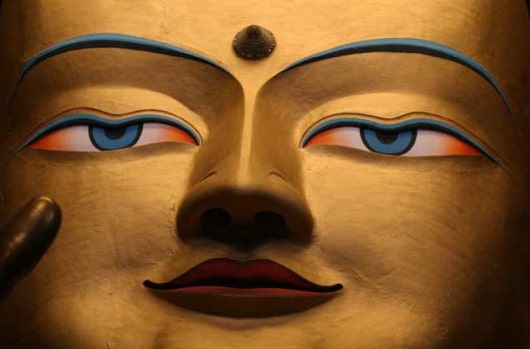
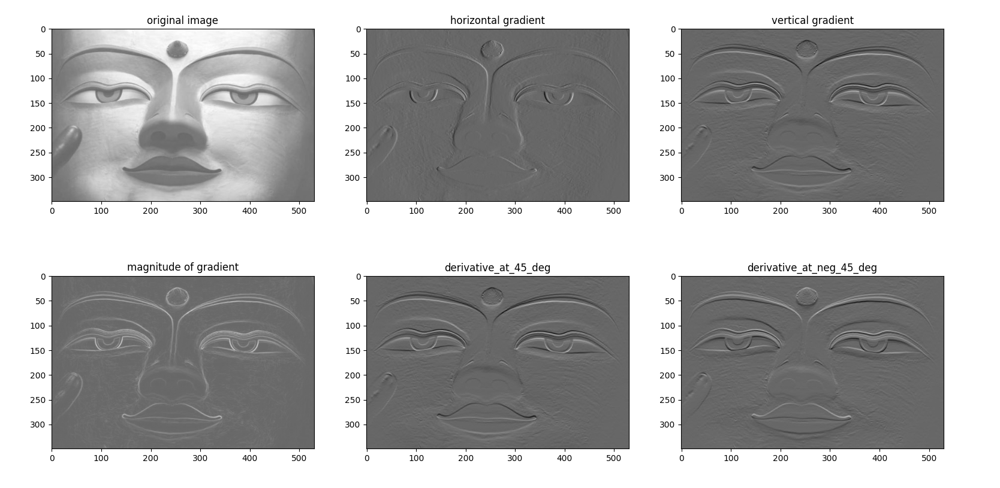
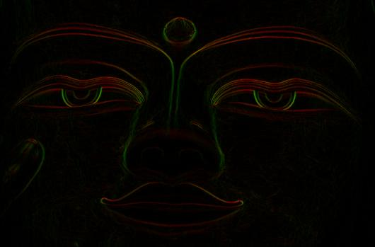

# Image Gradients 

This repo contains my script for creating the gradients of image in different orientation.
More specifically: gradient along x-axis, y-axis, 45 degree, and -45 degree (based on the x-axis).

# Resulting images
### Input image

### Gradient images from multiple directions:

### Gradient magnitude and orientation:

The gradient orientation is computed with: 

and the magnitude of gradient at each pixel is computed with:

